  

---

## `whoami`

 I'm a Computer Science student focused on Machine Learning and Deep Learning.

 Currently building strong foundations in ML while exploring Computer Vision,
 Natural Language Processing, and modern AI systems.

 I enjoy understanding the mathematics behind models, building end-to-end
 projects, and writing clean, production-oriented code.

- Currently building end-to-end ML and AI projects, from data prep to a deployed interface.
- Currently exploring LLMs, RAG pipelines and agentic systems.
- Comfortable moving between a Jupyter notebook, a training loop and the service around them.
- Always happy to talk about model evaluation, system design or a good terminal setup.

---

## `cat education.txt`

| Institution | Programme | Timeline |
| :--- | :--- | :--- |
| **Scaler School of Technology** | Computer Science and Engineering | 2024 - 2028 |
| **BITS Pilani** | B.Sc. Computer Science | 2024 - 2027 |

---

## `ls ~/stack`

**Languages**

**Machine learning and data**

---

## `./contributions.sh`

  

